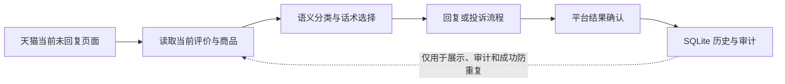
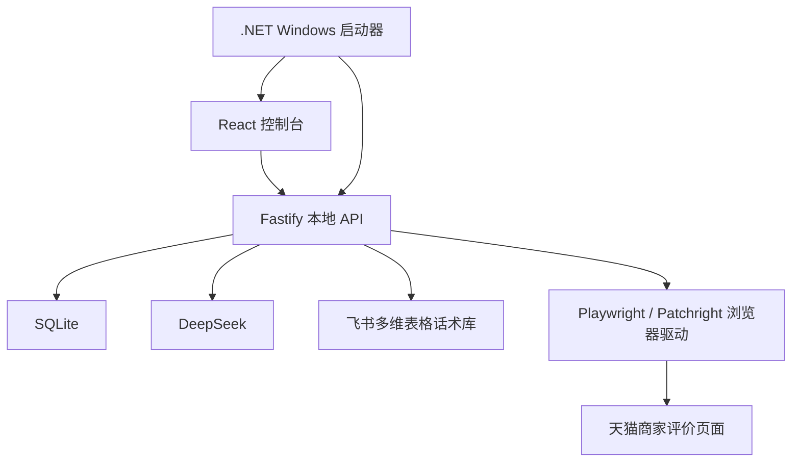

# 天猫评论智能处理控制台

一个面向天猫商家评价场景的本地自动化控制台：以当前页面识别到的评价为处理来源，结合 DeepSeek 语义判断和飞书话术库完成分类、话术选择、商品措辞适配、回复提交、投诉预审与结果审计。

项目采用“页面事实优先、数据库只做记录、失败继续下一条”的执行原则。它不会把导入的旧数据库当作待办队列，也不会因为某一条评价处理失败而停止整轮任务。

> [!IMPORTANT]
> 本项目不是天猫或淘宝官方产品。请仅在你有权管理的商家账号中使用，并自行遵守平台规则、账号权限和当地法律。自动化操作可能受页面变化、网络状态和平台风控影响。

## 控制台界面

以下图片均由独立内存数据库、虚构商品和虚构评论生成，不包含真实店铺、买家、订单或密钥。

### 工作台概览


### 自动处理中心


### 回复结果与审计


## 核心能力

- **页面事实优先**：每轮从当前天猫“有内容未回复”页面开始识别和处理，不从 SQLite 旧记录中挑选下一条任务。
- **完整队列遍历**：支持日期范围、分页遍历、自动计划和统一运行间隔；单条失败会记录原因并继续后面的评价。
- **智能分类**：综合评价语义、商品标题、话术库全部分类、一级/二级分类和关键词进行判断，不依赖单一关键词硬匹配。
- **商品级话术匹配**：能区分耳机、扩音器等不同商品语境；精确分类找不到时回退到通用好评或通用差评话术。
- **商品措辞适配**：抽取话术后仅修正当前商品需要变化的名称和措辞，拦截旧产品名、虚构参数和不当承诺。
- **明星评价跳过**：评价明确或隐含提及明星、艺人、偶像、代言人、网红、博主或主播时，不自动回复。
- **安全提交**：提交前核对当前评价、回复框和提交按钮；提交后以平台明确成功状态或评价移出未回复列表作为证据。
- **投诉语义预审**：只有语义确实符合平台投诉类型时才进入投诉流程；没有投诉入口时按平台已处理跳过，只有填写并点击提交且平台确认成功才算本系统投诉成功。
- **可审计历史**：记录分类依据、话术版本、最终回复、提交结果、投诉结果和失败原因，支持服务端分页、搜索和筛选。
- **记录清理**：支持“清理已完成记录”和“清理未成功记录”；自动任务运行期间禁止批量清理。
- **人工接管**：验证码、需要登录、关键页面无法判断或高风险状态会留下明确记录，后续评价仍可按安全边界继续处理。

## 处理原则

### 页面与数据库



- 页面上当前可见且仍可回复的评价，才是自动处理输入。
- `data/tmall-review-console.sqlite` 保存历史结果，但不是优先队列。
- 导入旧数据库后，回复结果页会显示其中的记录；非成功旧记录不会阻止页面上的真实未回复评价再次处理。
- 已有明确发送成功证据的记录继续用于防止重复回复。
- 网络中断或页面异常会记录具体阶段和原因，不会把“可能失败”伪装成成功。

### 分类与兜底

1. 读取评价内容和当前商品标题。
2. 将好评、差评话术库的全部可用分类、层级和关键词提供给语义分类。
3. 先判断真实情感，再选择最符合评价重点与商品类型的分类。
4. 没有可靠精确分类时，好评使用 `通用整体好评类`，差评使用 `通用差评类`。
5. 明星或公众人物相关评价直接跳过回复。

### 投诉判定

- 普通产品体验评价不会仅因为包含负面词语就自动投诉。
- 投诉候选先经过语义审查和平台类型映射。
- 当前行不存在投诉入口时，视为平台侧已判定或无需再次投诉，记录原因并继续下一条。
- 打开投诉界面后如果平台拒绝提交，会记录平台结果，不会写成本系统投诉成功。
- 只有完成类型选择、内容填充、点击提交并取得成功确认，才记录为本系统投诉成功。

## 技术架构



| 模块 | 作用 |
| --- | --- |
| `apps/web` | React 控制台、运行状态、回复结果、投诉记录和设置 |
| `apps/server` | Fastify API、任务编排、DeepSeek/飞书客户端、SQLite 和浏览器自动化 |
| `apps/launcher` | 自包含 Windows 启动器 |
| `packages/domain` | 领域模型、话术合同、归一化规则和状态机 |
| `tests/e2e` | 使用内存数据和模拟浏览器驱动的端到端检查 |

## 环境要求

- Windows 10/11
- Node.js 22 或更高版本
- npm
- Google Chrome
- 构建 Windows 便携包时需要 .NET 8 SDK

## 本地开发

```powershell
git clone <your-repository-url>
cd tmall-review-console
npm ci
npm run dev
```

开发控制台默认通过本地回环地址打开。首次启动会在 `data/` 下创建 SQLite 数据库和浏览器 profile；该目录已被 Git 忽略。

## 首次配置

1. 在设置页保存天猫商家登录信息，并在浏览器中完成人工验证码或安全验证。
2. 创建具备飞书多维表格只读权限的自建应用，配置 App ID 和 App Secret。
3. 分别配置好评、差评飞书 Base 链接，检查字段后同步话术。
4. 配置 DeepSeek API Key，并完成模型连通性测试。
5. 在工作台设置处理日期、自动运行时间段和运行间隔。
6. 根据需要维护“自动跳过商品”名单和投诉自动提交开关。

凭据不会写入仓库：

- DeepSeek API Key、飞书 App Secret 和商家密码保存在当前 Windows 用户的凭据管理器。
- SQLite 只保存非机密配置、处理记录和审计信息。
- 页面不会回显已保存的 Secret。

## 话术库格式

好评库至少包含：

```text
关键词分类 | 包含关键词 | 回复话术 1 | 回复话术 2 | ...
```

差评库至少包含：

```text
一级分类 | 二级分类 | 包含关键词 | 回复话术 1 | 回复话术 2 | ...
```

分类名称、分类层级和关键词都会参与语义判断。商品专用分类可以直接写入产品名称或产品族，例如扩音器相关分类；没有精确匹配时仍会使用通用兜底。

## 数据迁移

如需在另一台电脑查看旧数据：

1. 完全关闭两台电脑上的程序。
2. 将旧数据库命名为 `tmall-review-console.sqlite`。
3. 放入新程序的 `data/` 目录。
4. 重新启动程序，数据库会自动执行结构迁移。

不要在程序运行时复制 `.sqlite-wal` 或 `.sqlite-shm`。旧数据导入后只用于展示、审计和成功防重复，不会被优先当作待办任务。

## 测试

```powershell
npm test
npm run typecheck
npm run build
```

Windows 非交互环境无法访问用户凭据管理器时，可以使用与 CI 相同的服务端命令：

```powershell
npm exec -w apps/server -- vitest run src --exclude src/security/credential-store.test.ts
```

自动化测试使用内存数据库、内存密钥和模拟平台驱动，不会向真实账号提交回复或投诉。

## Windows 便携包

公开分发只能构建不含本地状态的干净包：

```powershell
npm run package:windows
```

`npm run package:windows:local` 会包含当前数据库和经过筛选的浏览器资料，只适合本人电脑间迁移，禁止上传到公开仓库或 GitHub Releases。

## 安全与隐私

仓库通过 `.gitignore` 和自动化安全测试排除：

- 数据库和 WAL/SHM 文件；
- 浏览器 profile、Cookies 和登录数据；
- 日志、诊断记录和迁移备份；
- 本地发布目录、ZIP 安装包和工作汇报；
- `.env`、Excel 业务文件和运行产物。

如果准备提交新文件，请先运行：

```powershell
node --test scripts/public-repo-safety.test.mjs
git status --short
```

不要对未经审查的工作区直接执行 `git add .`。

## 许可证

[MIT](LICENSE)
