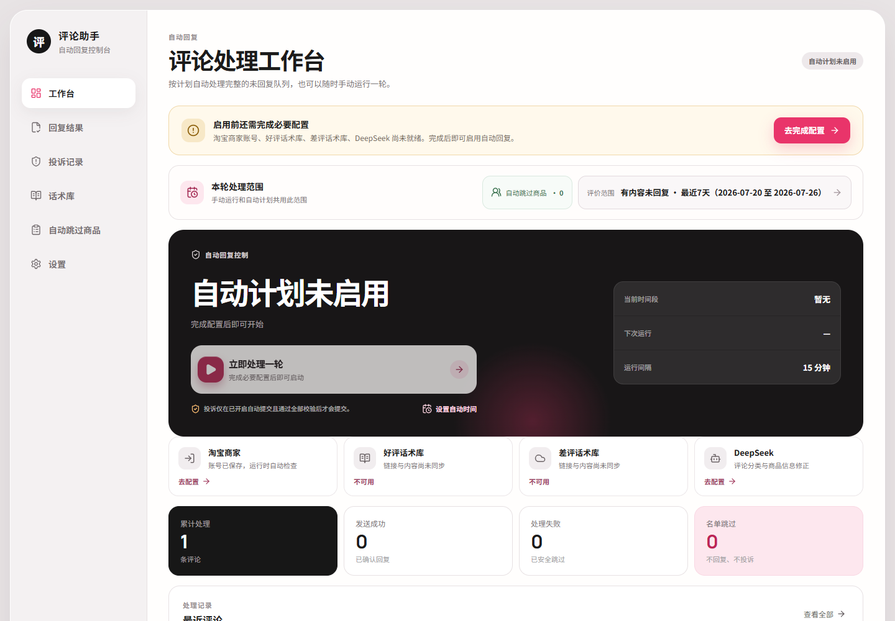
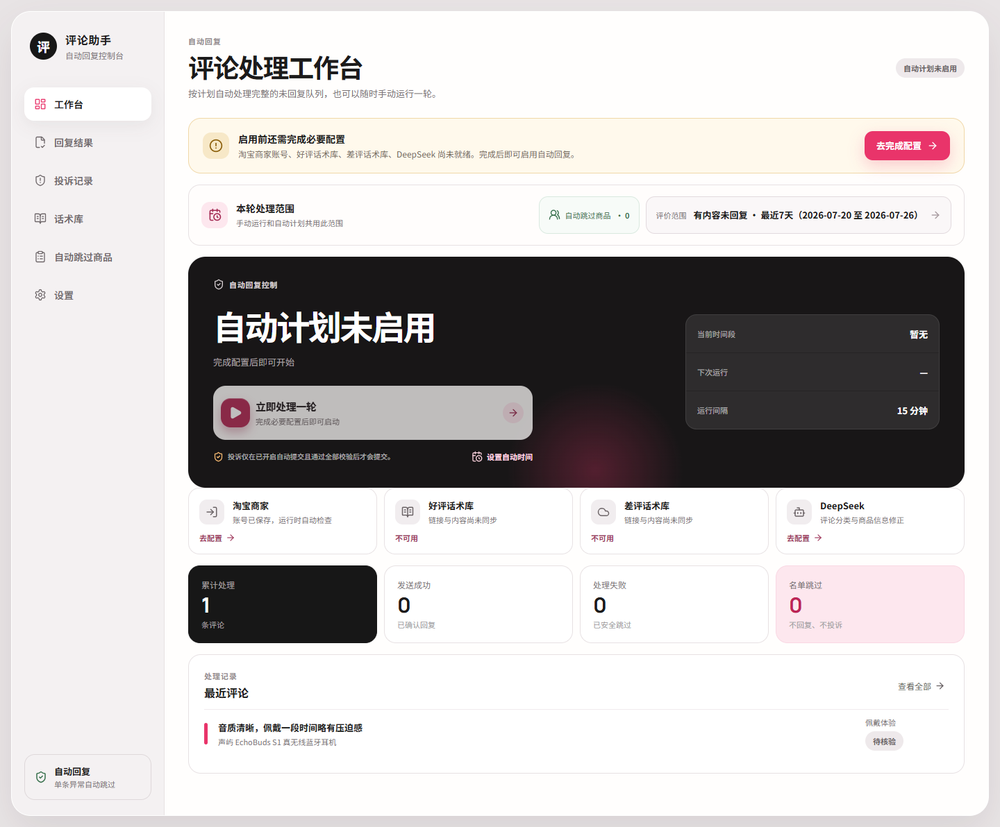
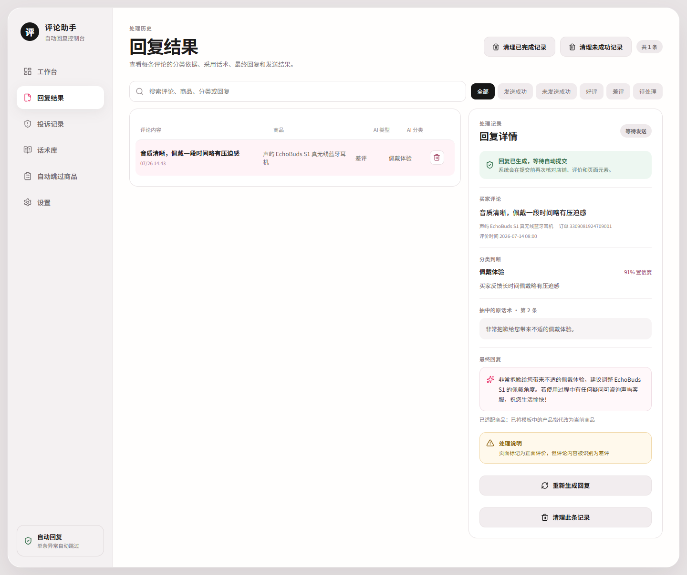
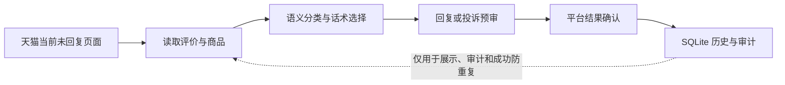
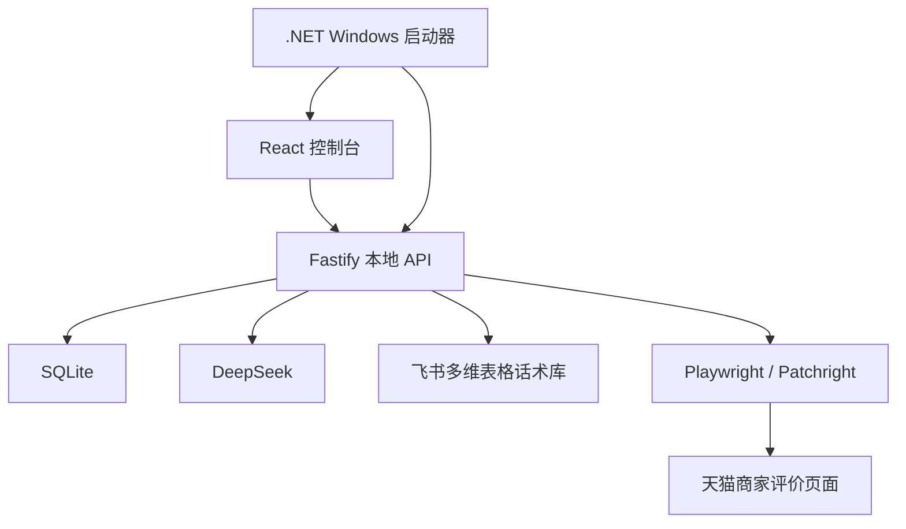

# 天猫评论智能处理控制台

面向天猫商家评价场景的本地自动化控制台：从当前未回复页面读取评价，结合 DeepSeek 与飞书话术库完成分类、话术选择、商品措辞适配、回复提交、投诉预审和结果审计。

项目坚持三个原则：**页面事实优先、数据库只做记录、单条失败继续后续任务**。

> [!IMPORTANT]
> 本项目不是淘宝或天猫官方产品。请仅在你有权管理的商家账号中使用，并遵守平台规则、账号权限与当地法律。登录验证、验证码和高风险状态需要人工处理；页面改版或平台风控也可能中断自动化。

## 界面预览

图片使用独立内存数据库、虚构商品和虚构评论生成，不包含真实店铺、买家、订单或密钥。

### 工作台概览



### 自动处理中心



### 回复结果与审计



## 核心能力

- **页面事实优先**：每轮以当前“有内容未回复”页面为输入，不从 SQLite 旧记录中挑选任务；
- **完整队列遍历**：支持日期范围、分页、计划运行和统一间隔，单条失败不会终止整轮；
- **语义分类**：综合评价、商品标题、分类层级与关键词判断，不依赖单一关键词；
- **商品级话术**：区分不同商品语境，精确分类缺失时回退到通用好评或差评话术；
- **措辞安全检查**：替换商品相关称呼，并拦截旧产品名、虚构参数和不当承诺；
- **明星评价跳过**：评价涉及明星、艺人、偶像、代言人、网红、博主或主播时不自动回复；
- **安全提交**：提交前核对评价、输入框和按钮，提交后要求平台成功证据；
- **投诉预审**：只有语义与平台投诉类型相符时才进入投诉流程；
- **审计记录**：保存分类依据、话术版本、最终回复、提交与投诉结果和失败原因；
- **人工接管**：无法可靠判断页面或出现验证时保留原因，交由人工处理。

## 处理链路



只有页面上当前可见且仍可处理的评价才会进入任务。`data/tmall-review-console.sqlite` 保存历史和成功防重信息，但不是待办队列。网络中断或页面异常会记录具体阶段，不会把不确定结果标记为成功。

### 回复规则

1. 读取评价内容与当前商品标题；
2. 将飞书话术库中的分类、层级和关键词提供给语义分类；
3. 先判断真实情感，再选择匹配商品和评价重点的话术；
4. 缺少可靠精确分类时，回退到 `通用整体好评类` 或 `通用差评类`；
5. 涉及明星或公众人物的评价直接跳过。

### 投诉规则

- 普通负面体验不会仅凭少量负面词自动投诉；
- 投诉候选先经过语义审查和平台类型映射；
- 当前行没有投诉入口时记录平台状态并跳过；
- 只有完成类型选择、内容填充、提交并获得成功确认，才记录为投诉成功。

## 技术架构



| 路径 | 用途 |
| --- | --- |
| `apps/web` | React 控制台、运行状态、回复与投诉记录 |
| `apps/server` | Fastify API、任务编排、外部服务、SQLite 与浏览器自动化 |
| `apps/launcher` | 自包含 Windows 启动器 |
| `packages/domain` | 领域模型、话术合同、归一化规则与状态机 |
| `tests/e2e` | 内存数据与模拟浏览器驱动的端到端检查 |

## 环境要求

- Windows 10/11；
- Node.js 22 或更高版本；
- npm；
- Google Chrome；
- 构建 Windows 便携包时需要 .NET 8 SDK。

## 本地开发

```powershell
git clone https://github.com/SmartLogicHub/tmall-review-console.git
cd tmall-review-console
npm ci
npm run dev
```

首次启动会在 `data` 目录创建 SQLite 数据库和浏览器 profile；该目录已被 Git 忽略。

## 首次配置

1. 在设置页保存天猫商家登录信息，并在浏览器中完成人工验证；
2. 创建具有飞书多维表格只读权限的自建应用，配置 App ID 与 App Secret；
3. 配置好评、差评 Base 链接，检查字段并同步话术；
4. 配置 DeepSeek API Key，完成连通性测试；
5. 设置处理日期、自动运行时间段与运行间隔；
6. 按需维护自动跳过商品名单和投诉自动提交开关。

DeepSeek API Key、飞书 App Secret 和商家密码保存在当前 Windows 用户的凭据管理器；SQLite 仅保存非机密配置与处理记录，页面不会回显已保存的 Secret。

## 飞书话术库

好评库至少包含：

```text
关键词分类 | 包含关键词 | 回复话术 1 | 回复话术 2 | ...
```

差评库至少包含：

```text
一级分类 | 二级分类 | 包含关键词 | 回复话术 1 | 回复话术 2 | ...
```

分类名称、层级和关键词都会参与语义判断。可以建立商品专用分类；没有精确匹配时仍会使用通用兜底。

## 数据迁移

1. 完全关闭新旧电脑上的程序；
2. 将旧数据库命名为 `tmall-review-console.sqlite`；
3. 放入新程序的 `data` 目录；
4. 重新启动，程序会自动执行结构迁移。

不要在程序运行时复制 `.sqlite-wal` 或 `.sqlite-shm`。导入的旧数据只用于展示、审计和成功防重复。

## 测试

```powershell
npm test
npm run typecheck
npm run build
```

Windows 非交互环境无法访问用户凭据管理器时，可使用 CI 同款命令：

```powershell
npm exec -w apps/server -- vitest run src --exclude src/security/credential-store.test.ts
```

测试使用内存数据库、内存密钥和模拟平台驱动，不会向真实账号提交回复或投诉。

## Windows 便携包

构建不含本地状态的公开分发包：

```powershell
npm run package:windows
```

`npm run package:windows:local` 会包含当前数据库和筛选后的浏览器资料，只适合本人设备间迁移，禁止上传到公开仓库或 GitHub Releases。

## 安全检查

仓库通过 `.gitignore` 和自动化测试排除数据库、浏览器资料、日志、迁移备份、`.env`、Excel 业务文件与本地发布产物。提交前建议运行：

```powershell
node --test scripts/public-repo-safety.test.mjs
git status --short
```

不要在未经检查的工作区中直接执行 `git add .`。

## 发布与许可证

仓库当前没有公开 GitHub Release。项目使用 [MIT 许可证](LICENSE)。
